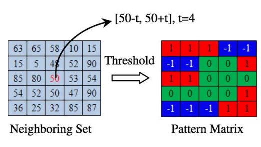
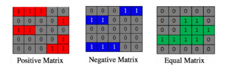
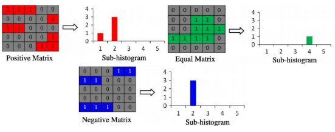

# SAR Image Classification with MLPH

Modified Multi-Level Pattern Histograms (MLPH) for SAR image classification.

Some results for different regions in and around New York City area:

## Dependencies

Platform tested on: **Ubuntu 16.04**

Softwares/Packages required:
- Python >2.6
- pickle
- numpy
- sklearn
- skimage
- scipy

## Instructions to Run the Application

- Open the terminal inside the directory “IP_Project_Group23”

- To run MLPH on training images and train SVM & test on hold-out set:

$ python -m sarclf -run_mlph 1 -train_svm 1

- To run pretrained SVM on test image pixels:

$ python -m sarclf

- To run pretrained SVM to classify an image:

$ python -m sarclf -test 0 -clfimg <image_path>

- For example, for image 2.tif in test_images folder, use:

$ python -m sarclf -test 0 -clfimg ./test_images/2.tif

- To do any of the above steps with our modified MLPH: Add “-modified 1”

Example:

$ python -m sarclf -test 0 -clfimg ./test_images/2.tif -modified 1

## Methodology

Following the research on MLPH, we derive a pattern matrix for each pixel based on a threshold value, use these matrices varying bin lengths to get local pattern sub-histograms, concatenated to give local pattern histogram. With multiple thresholds, the concatenation of local pattern histograms gives MLPH for each pixel.

