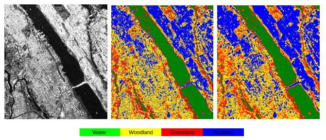
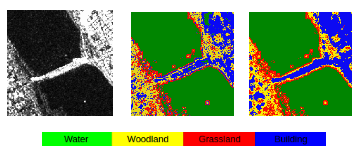

# SAR.AI

Modified Multi-Level Pattern Histograms (MLPH) for SAR image classification.

Some results for different regions in and around New York City area:

## Methodology

Following the research on MLPH, we derive a pattern matrix for each pixel based on a threshold value, use these matrices varying bin lengths to get local pattern sub-histograms, concatenated to give local pattern histogram. With multiple thresholds, the concatenation of local pattern histograms gives MLPH for each pixel.

